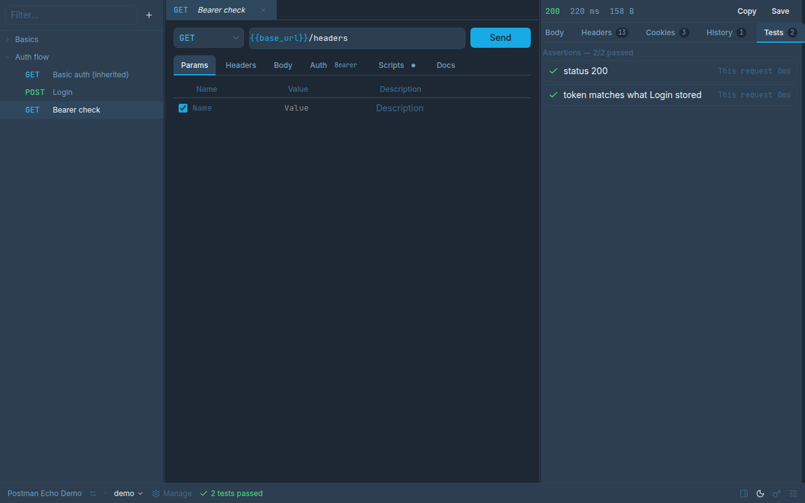
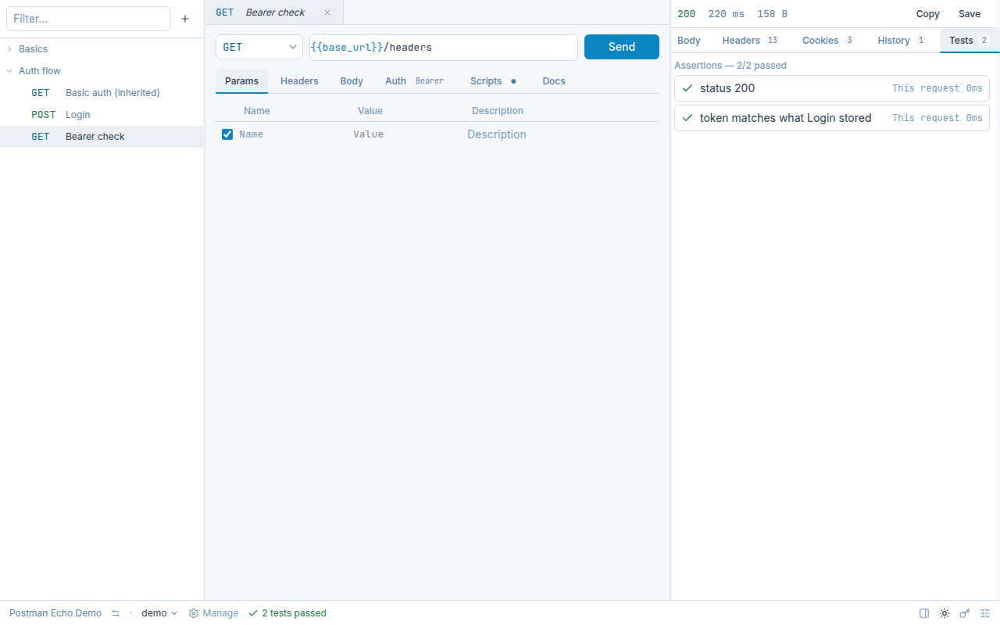

<div align="center">

# Wttp

**An open source HTTP client for developing, testing and documenting APIs.**

Local-first · Git-friendly · Free forever

</div>

<p align="center">
  
  
</p>

---

> **Status.** The core app — HTTP engine, workspaces, environments, auth, scripts,
> importers — is feature-complete and covered by an automated test suite (see the
> [backlog](arch-docs/backlog/README.md)). Packaging and release automation are landing now
> ([EP-11](arch-docs/backlog/EP-11-distribuicao.md)); until the first tagged release exists,
> run it from source with `yarn dev` (see [Development](#development) below).

## What is Wttp?

Wttp is a desktop app for working with HTTP APIs — in the spirit of Postman, Insomnia
and Bruno, with two commitments:

- **Your data stays yours.** Workspaces, collections and environments are plain YAML
  files on your machine. No account, no cloud sync, no lock-in.
- **Built for Git.** One file per request, deterministic serialization, clean diffs.
  Review API changes in pull requests like any other code.

## Features

|                  |                                                                             |
| ---------------- | --------------------------------------------------------------------------- |
| **Requests**     | Every HTTP method, headers, query params, JSON/form/multipart/binary bodies |
| **Collections**  | Folder tree mirroring your files, drag & drop, tabs                         |
| **Environments** | Per-environment variables with `{{interpolation}}` and scoped precedence    |
| **Auth**         | Bearer, Basic and API Key, inheritable from folder or collection            |
| **Scripts**      | Pre-request and test scripts in a sandboxed JS runtime                      |
| **Import**       | Postman v2.1, Insomnia v4, OpenAPI 3.x and cURL commands                    |
| **Auto-update**  | Checks in the background, asks before installing (skipped on `.deb`)        |
| **Docs**         | Markdown documentation per request, exportable _(planned)_                  |

Want to see it work without setting anything up? Open
[`examples/postman-echo-demo`](examples/postman-echo-demo) — a ready-made workspace
exercising collections, environments, auth (inherited Basic + a Login → Bearer token
flow) and scripts against a public API, no account needed. Walkthrough in
[arch-docs/getting-started.md](arch-docs/getting-started.md).

## How it compares

|                  | Wttp                             | Postman                             | Insomnia                     | Bruno                               |
| ---------------- | -------------------------------- | ----------------------------------- | ---------------------------- | ----------------------------------- |
| Storage          | Plain YAML, your disk            | Cloud account (local export exists) | Cloud or local (SQLite)      | Plain files (Bru format), your disk |
| Account required | Never                            | For most features                   | For sync                     | Never                               |
| Git-friendly     | Yes — one YAML file per request  | Exported JSON, not designed for it  | Partial (local vault, JSON)  | Yes — its whole pitch               |
| Scripting        | Sandboxed JS (`utilityProcess`)  | Full Node-like sandbox, more mature | JS, less mature than Postman | JS, similar scope to Wttp           |
| Maturity         | Pre-1.0, single core team so far | Long-established, huge feature set  | Established                  | Established, growing fast           |

Bruno is the closest philosophical relative — if you already use it and it fits, there's
no urgent reason to switch. Wttp's bet is the same "files on disk, no account" model,
built from scratch around Electron + Vue with a stricter contract on serialization
(round-trip byte-identical saves) and a more explicit variable-resolution model.

## Development

```sh
yarn          # install
yarn dev      # run in development
yarn test     # run tests
yarn lint     # lint
yarn build    # build all processes
```

Building installers: `yarn build:win`, `yarn build:mac`, `yarn build:linux` (never
publishes anywhere). See [arch-docs/getting-started.md](arch-docs/getting-started.md) for using
the app once it's running, and [arch-docs/release.md](arch-docs/release.md) for how tagged
releases get signed, packaged and published.

## Contributing

Contributions are welcome. Start with [arch-docs/backlog/README.md](arch-docs/backlog/README.md)
to find something to work on, and read [CONTRIBUTING.md](CONTRIBUTING.md) and
[arch-docs/conventions.md](arch-docs/conventions.md) before opening a pull request.

Engineering documentation under `arch-docs/` is written in Portuguese; code, UI strings and commit
messages are in English.

## License

MIT
